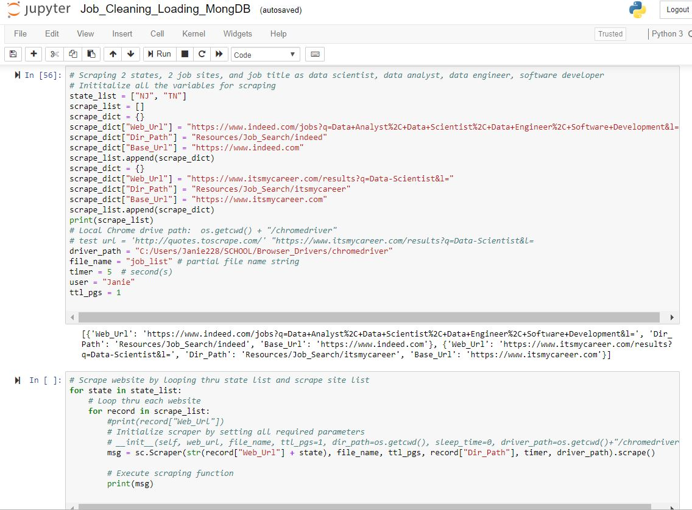
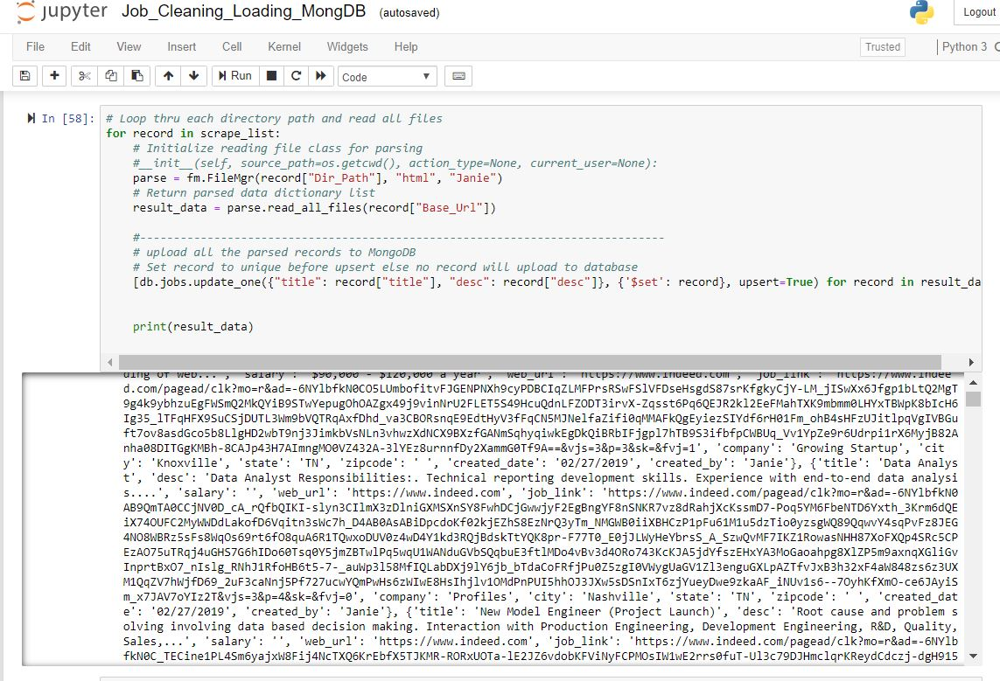
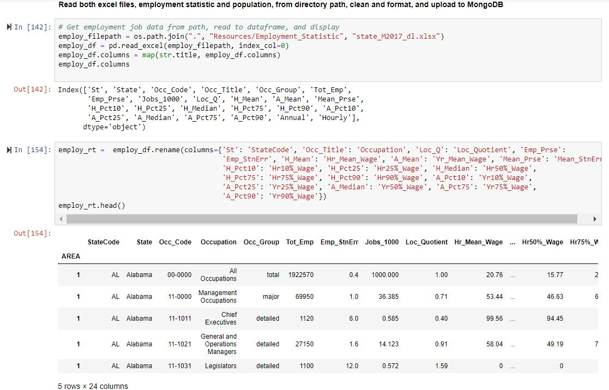

# Job Market Analysis                                                                 
-----
## Background:
To meet the project requirements stated in Instruction folder and to help job seekers have a glimpse of the job market and payscale, I choose to do web scraping on two websites for specific job(s) in specific location(s), and analyzing these data in relation to government employment dataset by occupation, state, and year. 

---
## Project Results 
* MongoDB Job_DB Snapshots

* Output folder excel files
* Datatable results in script file: Job_Analysis_MongoDB.ipynb
* Data processing snapshots
  1) web-scraping 
    
  2) upsert to mongoDB
    
  3) reading & cleaning excel data
     

---
## Technologies Used
Visual Studio Code, Python, Jupyter Notebook, MongoDB, chrome driver, pandas, Beautiful Soup, Splinter, html dataset, excel dataset

---
## Installation/Setup
* Clone this repo to your computer
* Make sure all the technologies above are installed and use Python 3+ 
* Open these 2 files in jupyter notebook:
  1) Job_Cleaning_Loading_MongDB.ipynb
  2) Job_Analysis_MongoDB.ipynb
* Make sure the criteria for the search and chrome driver path (see image below) are customized and updated in Job_Cleaning_Loading_MongDB.ipynb before running the script

* Update the appropriate codes in Job_Analysis_MongoDB.ipynb if a lot of changes are made in the above file

---
## Project Workflow Process
* Scrape specific jobs dataset from two websites, "https://www.indeed.com" and "https://www.itsmycareer.com", for current jobs and save each webpage as html file
* Read each html file, extract, transform, and load data into Job Mongo database
* Download excel files from government website, "https://www.bls.gov", for employment by occupation, state, and year dataset
* Read each excel file into dataframe, extract, transform, and load data to Job Mongo database
* Read selected data from MongoDB back into dataframe for further transformation
* Save result dataset into excel sheet in Output directory for analysis

---
## :warning: Important Notes
* If the scraping web urls (itsmycareer & indeed) changed, code in the three .py scripts need to be updated.

-----
#### Copyright
© 2019 Janie. All Rights Reserved.

