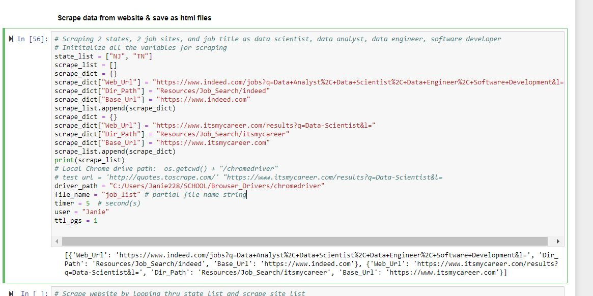
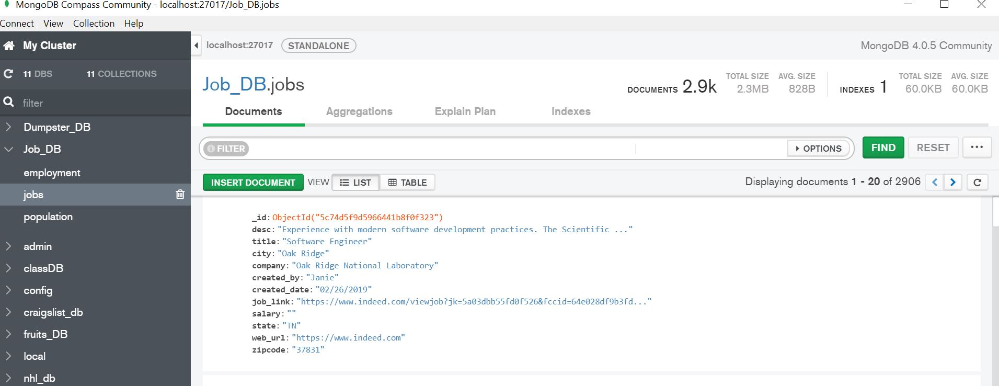
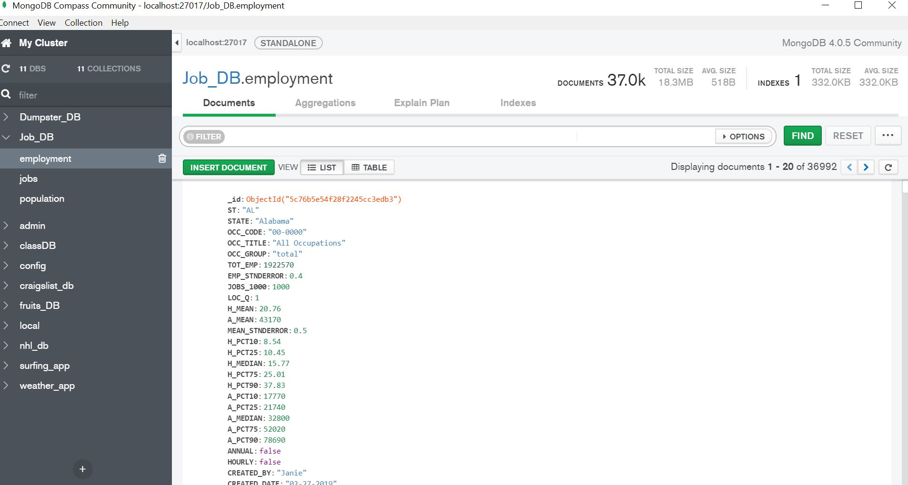
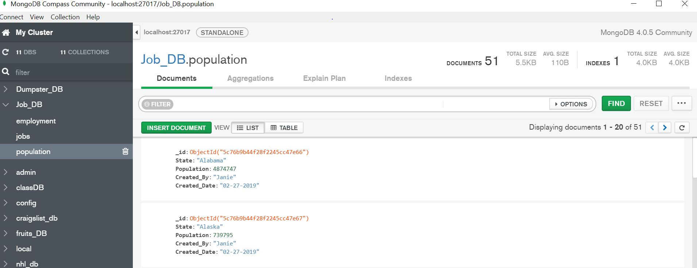

# Job Search ETL
-----
Scrape itsmycareer.com and/or indeed.com websites for current jobs in a specific location, and analyze job market by comparing to government employment data by occupation, state, and year to get an overview on the job market and payscale. 

Development still in progress.
 
# Technologies Used
Visual Studio Code, Python, Jupyter Notebook, MongoDB, chrome driver, pandas, Beautiful Soup, Browser (splinter) 

# Installation/Setup
* Clone this repo to your computer
* Make sure all the technologies are installed and use Python 3 (see above)
* Open these 2 files in jupyter notebook:
  1) Job_Cleaning_Loading_MongDB.ipynb
  2) Job_Analysis_MongoDB.ipynb
* Make sure the search changes and chrome driver path are updated in Job_Cleaning_Loading_MongDB.ipynb before running the file

* Update the appropriate codes in Job_Analysis_MongoDB.ipynb if a lot of changes are made in the above file

# Process Flow
Data Science jobs analysis for Tennessee 2019: 

* Scrape websites, "https://www.indeed.com" and "https://www.itsmycareer.com", for current jobs and save each webpage as html file
* Read each html file, format, and store data into MongoDB job database
* Download excel file from "https://www.bls.gov" for employment by occupation and state
* Read the excel files into dataframe, format and merge with US population by state, and load to job database
* Select the desired columns from MongoDB and read back to dataframe for analysis
* Save result dataset into excel sheet in Output directory

# MongoDB Job_DB

